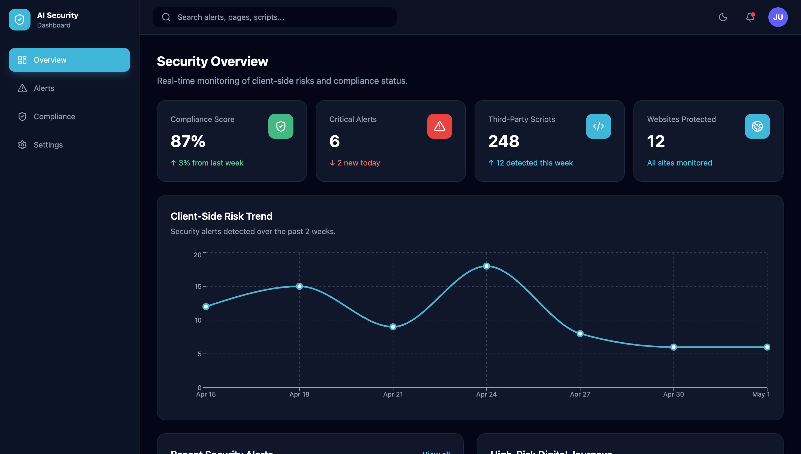
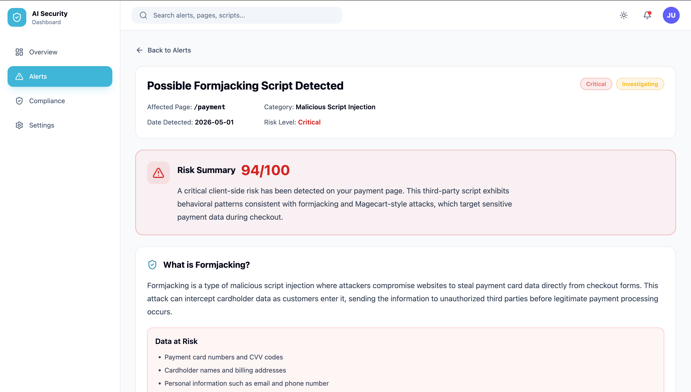
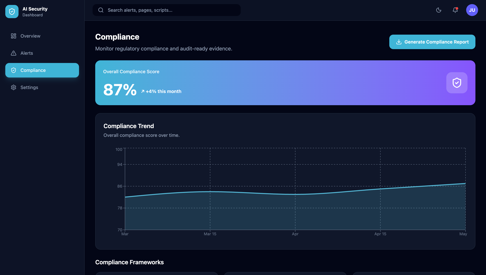
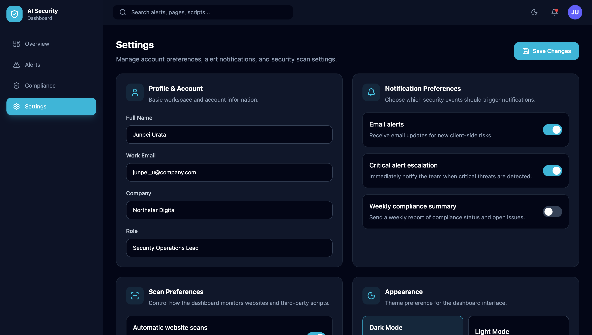
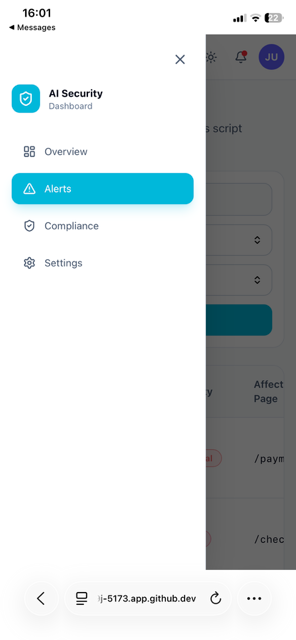
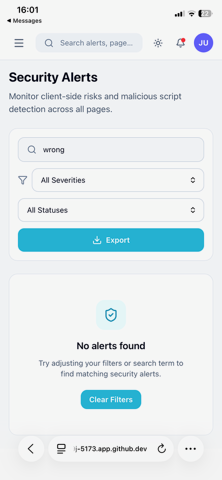
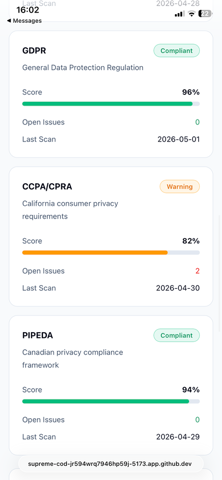

# AI Security Dashboard

A mock AI-powered security and compliance dashboard built as a front-end portfolio project.

This project simulates a SaaS dashboard that helps companies monitor client-side website risks, suspicious third-party scripts, compliance issues, and high-risk security alerts. It uses mock data to demonstrate how a security team might review alerts, investigate risks, monitor compliance frameworks, and manage dashboard settings.

## Live Demo

Coming soon.

## Project Purpose

The goal of this project was to practice building a polished front-end dashboard for a complex technical product. I wanted to create an interface that feels realistic for an AI security or compliance platform while keeping the information clear and easy to understand.

The dashboard focuses on:

- Client-side security risks
- Suspicious scripts and trackers
- Compliance monitoring
- Alert investigation workflows
- Responsive SaaS dashboard design
- Dark and light mode support

## Features

- Dashboard overview with security and compliance summary cards
- Risk trend chart using mock data
- Alerts page with search, filters, severity badges, and status badges
- Alert detail page for investigating a critical formjacking risk
- Compliance page with framework cards, compliance gaps, and audit-ready evidence
- Settings page with profile, notification, scan, API key, and theme sections
- Fake export buttons for CSV and compliance reports
- Empty state when no alerts match the filters
- Loading skeleton states
- Responsive mobile navigation
- Dark/light mode toggle with saved theme preference

## Tech Stack

- React
- Vite
- Tailwind CSS
- Recharts
- Lucide React Icons
- GitHub Codespaces

## Screenshots

### Dashboard Overview



### Security Alerts



### Alert Detail


### Compliance Monitoring



### Settings



### Mobile Navigation



### Mobile Empty State



### Mobile Compliance Page



## Pages

### Dashboard Overview

The overview page gives users a quick snapshot of the platform’s security status, including compliance score, critical alerts, third-party scripts monitored, websites protected, recent alerts, and high-risk digital journeys.

### Alerts Page

The alerts page displays mock security alerts in a table format. Users can search alerts, filter by severity and status, view severity badges, and open the alert detail page.

### Alert Detail Page

The alert detail page explains a critical formjacking risk in plain language. It includes a risk summary, data at risk, recommended actions, related compliance frameworks, and an activity timeline.

### Compliance Page

The compliance page shows an overall compliance score, a compliance trend chart, framework cards, compliance gaps, and audit-ready evidence.

### Settings Page

The settings page includes profile information, notification preferences, scan preferences, appearance settings, a demo API key, and monitored websites.

## Mock Data

This project uses mock data only. It does not connect to a backend, real scanner, or security product. The purpose is to demonstrate front-end design, layout, state management, filtering, responsive UI, and product thinking.

## What I Learned

Through this project, I practiced:

- Building a multi-page React dashboard
- Creating reusable UI components
- Managing local state for filters, selected alerts, loading states, and theme switching
- Designing for both desktop and mobile
- Creating accessible dark and light mode styles
- Presenting complex security information in a clear interface
- Organizing a GitHub portfolio project with screenshots and documentation

## Future Improvements

Possible future improvements include:

- Add real routing with React Router
- Add chart interactions and more detailed analytics
- Add a mock login screen
- Add downloadable CSV/report generation
- Add more advanced table sorting
- Add unit tests
- Connect to a mock API instead of local data files

## How to Run Locally

Clone the repository:

```bash
git clone https://github.com/junpeiurata/ai-security-dashboard.git